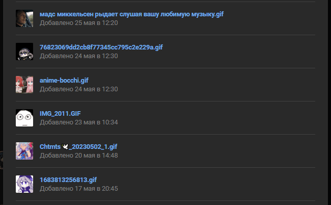
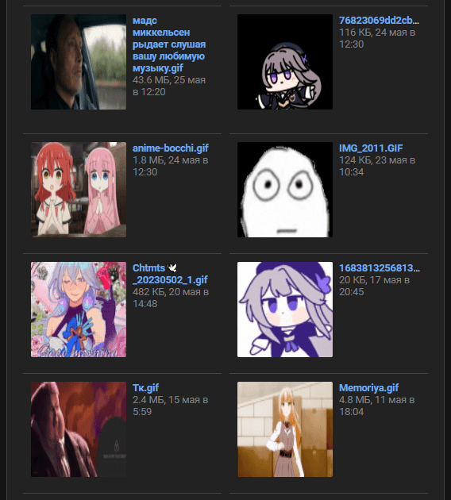

# VKFileExtension

1) Перейти на chrome://extensions/
2) Выбрать сверху слева "Загрузить распакованное расширение"
3) Выбрать скаченную папку с расширением

    Как выглядела вкладка до расширения:

    Как выглядит после:

